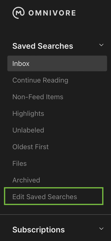
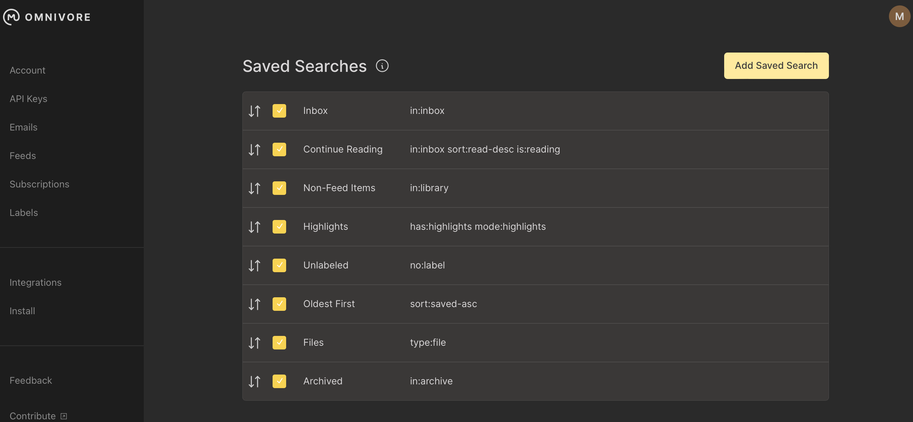
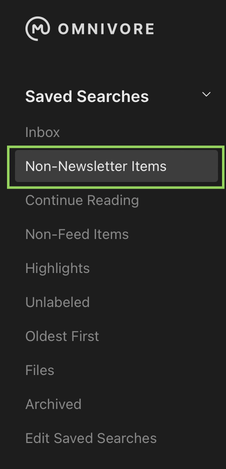

# {{ $frontmatter.title }}

[[toc]]

Use the Saved Searches menu to refine your Library view (some filters may be visible by default).

- Select `Read Later` to view a list of all your non-archived links except Newsletters.

- Select `Highlights` to view the text selections you have highlighted in all your saved pages.

- Select `Today` to view a list of links you saved today.

- Select `Newsletters` to view links saved via your newsletter subscriptions.

## Accessing Saved Searches on iOS

- Tap the dropdown button in the top left of the library. The Saved Searches button shows the currently active saved search. By default, this is `Inbox`.

## Accessing Saved Searches on the Web

- Choose the saved search you'd like to use from the ribbon buttons at the top of the library. The active seach is displayed in yellow. By default, this is `Inbox`

## Editing Saved Searches on the Web

- Click on the `Edit Saved Searches` [link](https://omnivore.app/settings/saved-searches) at the bottom of the  `Saved Searches`  section of the Web app. 

- There you can : re-order the items, toggle their visbility and, for custom saved searches, delete them.

- To create a custom saved searches, click the  `Add Saved Search` button then enter a name and a [query](./search.md).

::: info 
Editing saved searches is not available on the native apps.
:::
